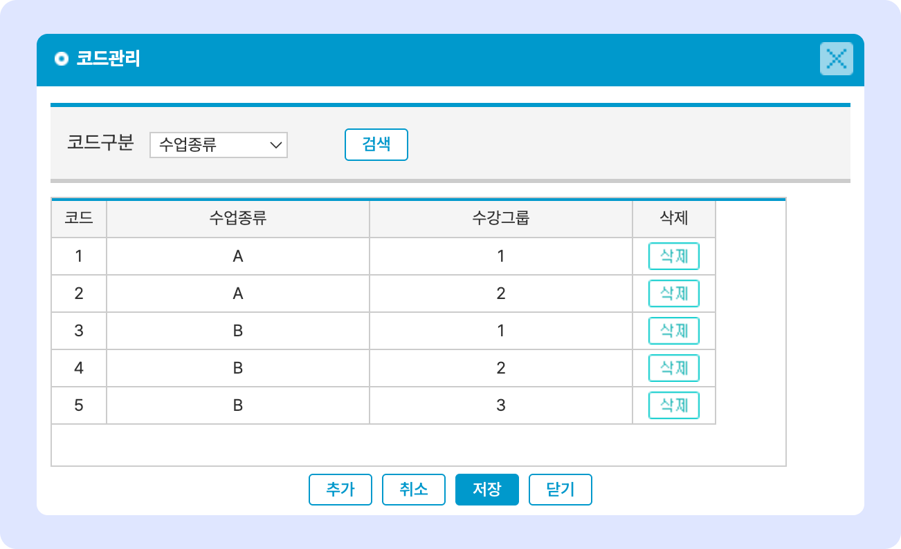

# 수업 종류 관리


맥가이 사용 가이드 문서가 채널톡으로 이전되었습니다.\
기존 문서는 더 이상 업데이트되지 않으니, 앞으로 최신 가이드는 채널톡에서 확인해 주세요.\
[**채널톡 바로가기↗**](https://docs.channel.io/macgai-guide/ko/articles/setting-class-61a21bd6#4.--%EC%88%98%EC%97%85%EC%A2%85%EB%A5%98-%EA%B4%80%EB%A6%AC)


↖ 상위항목: [학급 공통 정보 설정](./)

## 수업 종류 관리

**수업종류**와 **수강그룹**을 만들어 학급을 구분할 수 있습니다. 지정 규칙은 별도로 없으며 학원의 상황에 맞게 조정하여 사용하시면 됩니다. 주로 '**수업종류-수강그룹'**&#xC758; 형태로 묶어 사용합니다.

<figure><figcaption></figcaption></figure>

1. **수강 그룹 추가**:  를 눌러 수업 종류와 수강 그룹 입력 후  합니다.
2. **저장된 내용 수정**: 수업 종류 혹은 수강 그룹을 눌러 값을 수정 후  버튼을 누르면 변경사항이 적용
3. **수강 그룹 삭제**:  버튼을 눌러 개별 항목을 지울 수 있습니다.
