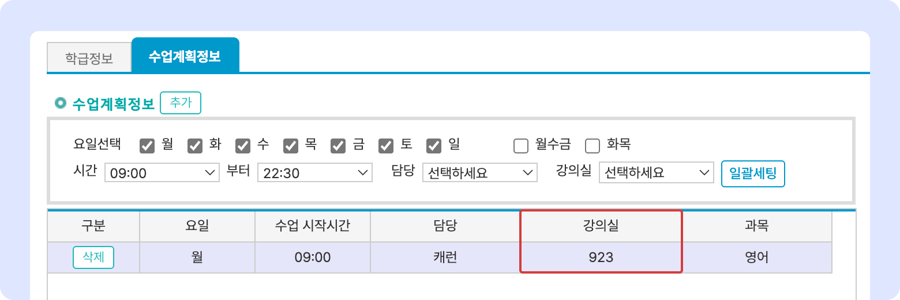

# 강의실 관리


맥가이 사용 가이드 문서가 채널톡으로 이전되었습니다.\
기존 문서는 더 이상 업데이트되지 않으니, 앞으로 최신 가이드는 채널톡에서 확인해 주세요.\
[**채널톡 바로가기↗**](https://docs.channel.io/macgai-guide/ko/articles/setting-class-61a21bd6#2.-%EA%B0%95%EC%9D%98%EC%8B%A4-%EA%B4%80%EB%A6%AC)


↖ 상위항목: [학급 공통 정보 설정](./)

## 강의실 관리

강의실 정보를 추가할 수 있습니다. 강의실 정보는 <mark style="color:red;">**수업 계획 정보 입력**</mark>에 사용됩니다.

<figure><figcaption></figcaption></figure>

* **강의실 정보 추가하기**:  를 눌러 강의실명 입력 후 
  * 저장 시 순번은 강의실 이름의 오름차순(숫자 → 영문 → 한글)으로 자동 지정됩니다.
* **등록된 강의실 수정**: 저장된 강의실의 이름을 눌러 정보를 수정 후  버튼을 누르면 변경사항이 적용됩니다.
* **강의실 정보 삭제하기**: 개별 항목 우측에 있는  버튼을 이용합니다.

#### 수업 스케쥴 작성 시 아래와 같이 사용됩니다.

<figure><figcaption></figcaption></figure>

##
