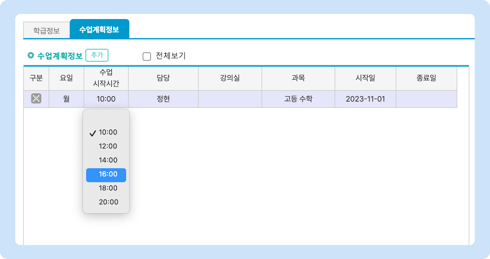

# 수업 시작 시간 설정


맥가이 사용 가이드 문서가 채널톡으로 이전되었습니다.\
기존 문서는 더 이상 업데이트되지 않으니, 앞으로 최신 가이드는 채널톡에서 확인해 주세요.\
[**채널톡 바로가기↗**](https://docs.channel.io/macgai-guide/ko/articles/61a21bd6-%EC%88%98%EC%97%85-%EA%B8%B0%EB%B3%B8-%EC%A0%95%EB%B3%B4-%EC%84%A4%EC%A0%95#1%EF%B8%8F%E2%83%A3-%EC%88%98%EC%97%85%EC%8B%9C%EC%9E%91%EC%8B%9C%EA%B0%84-%EC%84%A4%EC%A0%95)


↖ 상위항목: [학급 공통 정보 설정](./)

수업 시작 시간을 설정할 수 있습니다.

<figure><figcaption></figcaption></figure>

1. 행을 삭제합니다.
2. 수업 시작 시간을 선택합니다. 1시간 / 5분 단위로 선택할 수 있어요.
3. 수업 시간 단위가 일정하게 반복될 경우 수업시간을 한 번에 설정 할 수 있습니다.


<mark style="color:red;">**수업 종료 시간**</mark>은 맥가이 내에서 사용되지 않으며, 값을 비워두어도 저장할 수 있습니다. 근시일 내에 삭제 될 예정이니 참고해주세요.


#### 설정 된 교시 시간은 수업계획정보 추가 시 <mark style="color:green;">**수업 시작 시간**</mark> 선택에 사용됩니다.

<figure><figcaption></figcaption></figure>
