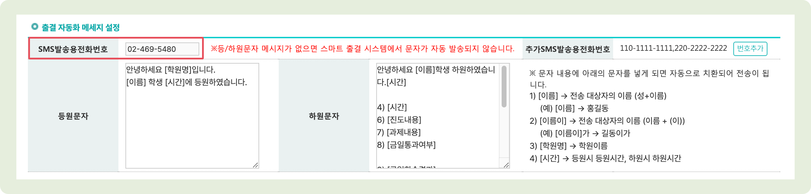
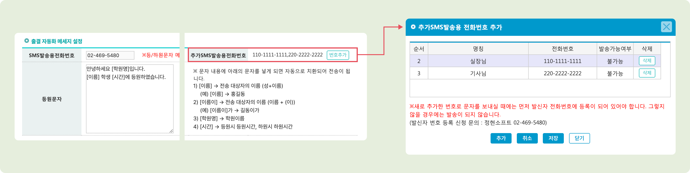

# 발신 번호 변경 및 추가


맥가이 사용 가이드 문서가 채널톡으로 이전되었습니다.\
기존 문서는 더 이상 업데이트되지 않으니, 앞으로 최신 가이드는 채널톡에서 확인해 주세요.\
[**채널톡 바로가기↗**](https://docs.channel.io/macgai-guide/ko/articles/sms-add-number-35775cae)


## 대표 발신 번호 변경

회원 가입 시, 등록한 SMS 발신 번호를 변경하고 싶으실 경우 별도로 유선 혹은 채팅 상담을 통해 **변경 신청**을 해주셔야 합니다.&#x20;

등록된 번호의 확인은 **관리메뉴 → 학원정보 → 학원정보관리** 메뉴의 ⭕ **출결 자동화 메시지 설정** 섹션의 'SMS 발송용 전화번호' 확인하실 수 있습니다.

<figure><figcaption></figcaption></figure>

## 발송용 선택 번호 추가

학원 내 모든 직원이 문자 발송에 사용할 수 있는 번호를 추가할 수 있습니다. ⭕ **출결 자동화 메시지 설정** 섹션의 **추가 SMS 발송용 전화번호**의  버튼을 눌러 추가 및 수정이 가능해요.

* 새로운 번호를 등록하여 사용하시려면 [발신 번호 사전 등록](pre-registration.md)이 필요합니다.

<figure><figcaption></figcaption></figure>
