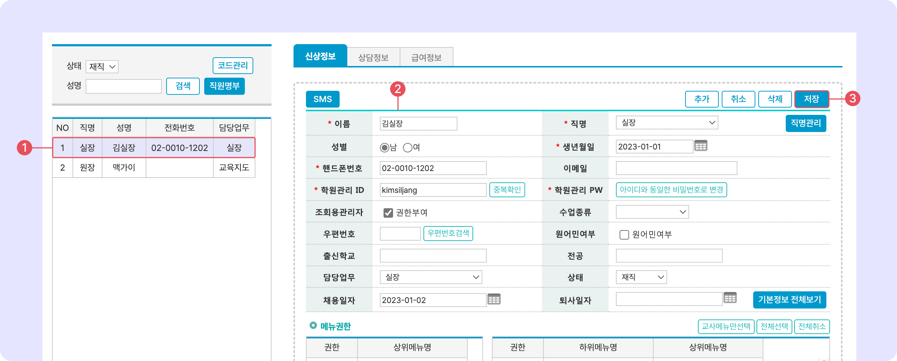

# 직원 정보 수정


맥가이 사용 가이드 문서가 채널톡으로 이전되었습니다.\
기존 문서는 더 이상 업데이트되지 않으니, 앞으로 최신 가이드는 채널톡에서 확인해 주세요.\
[**채널톡 바로가기↗**](https://docs.channel.io/macgai-guide/ko/articles/staff-basic-b5221267)


↖ 상위항목: [직원 정보 관리](./)


**이용 메뉴:** 관리메뉴 → 직원관리 → **직원목록**


## 직원 정보 수정하기

<figure><figcaption></figcaption></figure>

1. 저장이 완료 된 직원을 선택
2. 정보를 수정합니다.
3. 을 눌러 변경사항을 적용합니다.
