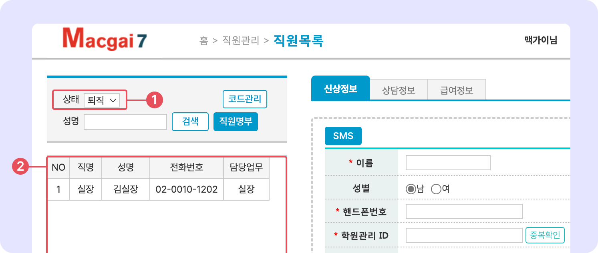

# 퇴직 처리 및 조회


맥가이 사용 가이드 문서가 채널톡으로 이전되었습니다.\
기존 문서는 더 이상 업데이트되지 않으니, 앞으로 최신 가이드는 채널톡에서 확인해 주세요.\
[**채널톡 바로가기↗**](https://docs.channel.io/macgai-guide/ko/articles/%EC%A7%81%EC%9B%90-%ED%87%B4%EC%A7%81-%EC%B2%98%EB%A6%AC-%EB%B0%8F-%EC%A1%B0%ED%9A%8C-1a020988)


↖ 상위항목: [직원 정보 관리](./)


**이용 메뉴:** 관리메뉴 → 직원관리 → **직원목록**


## 퇴직 처리

<figure><figcaption></figcaption></figure>

1. 직원을 선택하고 상태를 퇴직으로 변경합니다.
2. 퇴사일자(마지막 근무일)를 지정하고 을 누르면 퇴직 처리가 완료 됩니다.


를 이용해 직원 정보를 제거하면 <mark style="color:red;">**영구 삭제**</mark> 처리 됩니다. 주의해서 사용해 주세요!


## 퇴직 처리된 직원의 조회

<figure><figcaption></figcaption></figure>

1. 직원목록에서 검색 조건의 상태에서 **퇴직**을 선택합니다.
2. 퇴직 처리 된 직원의 목록을 볼 수 있습니다.
