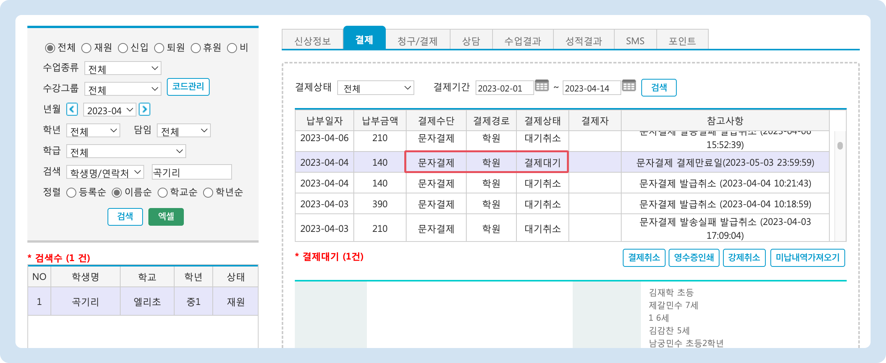

# 결제 알림톡 발송


맥가이 사용 가이드 문서가 채널톡으로 이전되었습니다.\
기존 문서는 더 이상 업데이트되지 않으니, 앞으로 최신 가이드는 채널톡에서 확인해 주세요.\
[채널톡 바로가기↗](https://docs.channel.io/macgai-guide/ko/articles/send-alltalkpay-sms-ecd22084)


## 문자결제 기본 설정

### 1. 청구서 자동파기 기한 설정

최초 발송 전 먼저 청구서 자동 파기 기한(문자결제 마감일) 설정을 해주시는 것이 좋습니다.

* 관리메뉴 → 학원정보 → **학원정보관리** 메뉴의 '**원비결제관련정보**' 섹션의 문자 결제 마감일 정보를 수정하여 파기 기한을 변경할 수 있습니다.
  * **1\~30일** 사이로 설정할 수 있습니다.
  * 마감일 기준 24시 00분에 파기 됩니다.
  * 청구서 파기일은 청구서 납부 내역에 별도 표시 됩니다.

### 2. 문자결제 발송수단 선택

문자결제로 사용할 서비스로 🔘**올톡페이**를 선택 후 <mark style="color:blue;background-color:blue;">\[저장]</mark> 버튼을 눌러주세요.

<figure><figcaption></figcaption></figure>

## 문자결제 알림톡 발송

미납내역 조회 후 올톡페이(문자결제) 알림톡을 발송할 수 있습니다. 1건 당 45 포인트를 사용합니다.


**사용메뉴**: 기본메뉴 → 학생관리 → 미납현황


### 발송 과정

<figure><figcaption></figcaption></figure>

1. 조건을 지정하고 미납 현황을 조회합니다.
2. 발송 대상 학생을 선택 합니다. (**이름** 왼쪽의 체크 버튼을 누르면 전체 학생을 선택/해제 할 수 있습니다)
3. <mark style="color:green;background-color:yellow;">\[결제문자발송]</mark> 버튼을 누르면 전송 여부 확인 후 알림톡을 발송합니다. (카카오톡이 설치 되어 있지 않은 경우 **LMS**로 발송됩니다)

### 알림톡 예시

학부모님은 아래의 이미지와 같이 알림톡을 받고 결제를 진행할 수 있습니다.

<figure><figcaption></figcaption></figure>

### 발송 여부 확인하기

#### 1) 학생관리 메뉴에서 확인

학생관리 또는 우측 검색 창을 이용해 학생을 검색 - 선택 후 결제 탭으로 이동합니다. 결제수단: **문자결제** / 결제상태: **결제대기**로 되어 있으면 결제 선생 알림톡이 정상적으로 발송 된 것입니다.

<figure><figcaption></figcaption></figure>

#### 2) 보낸 문자 메시지에서 확인

\[마이페이지] → \[**보낸문자메시지]**&#xB85C; 이동합니다.

1. **문자결제** 탭을 선택하여 검색합니다.
2. 문자결제 발송 건의 전송 상태를 확인할 수 있습니다.

<figure><figcaption></figcaption></figure>
